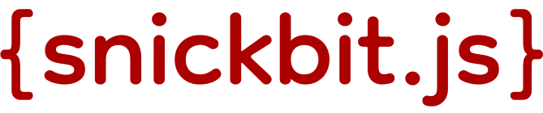

 

	

<h3 style="text-align: center;">A <a href="https://en.wikipedia.org/wiki/Monorepo">monorepo</a> of JavaScript packages and tools for personal use</h3>

[![MIT License][license-shield]][license-url]
[![LinkedIn][linkedin-shield]][linkedin-url]
[![Issues][issues-shield]][issues-url]

<!--START_SECTION:readmes-toc-->

## Table of Contents

* [CLIs](#clis)
  - [npx snickbit](#npx-snickbit)
* [Libraries](#libraries)
  - [@snickbit/cycle](#snickbit-cycle)
  - [@snickbit/dates](#snickbit-dates)
  - [@snickbit/model](#snickbit-model)
  - [@snickbit/node-utilities](#snickbit-node-utilities)
  - [@snickbit/plural](#snickbit-plural)
  - [@snickbit/queue](#snickbit-queue)
  - [@snickbit/upwords](#snickbit-upwords)
  - [@snickbit/utilities](#snickbit-utilities)

<!--END_SECTION:readmes-toc-->

---

<!--START_SECTION:readmes-packages-->

## CLIs

## Libraries

<!--END_SECTION:readmes-packages-->

## License

Copyright (c) 2022 Nicholas Lowe

[MIT License](https://github.com/snickbit/snickbit.js/blob/main/LICENSE)

[issues-shield]: https://img.shields.io/github/issues/snickbit/snickbit.js.svg?style=for-the-badge

[issues-url]: https://github.com/snickbit/snickbit.js/issues

[license-shield]: https://img.shields.io/github/license/snickbit/snickbit.js?style=for-the-badge

[license-url]: https://github.com/snickbit/snickbit.js/blob/main/LICENSE

[linkedin-shield]: https://img.shields.io/badge/-LinkedIn-black.svg?style=for-the-badge&logo=linkedin&colorB=555

[linkedin-url]: https://linkedin.com/in/snickbit
